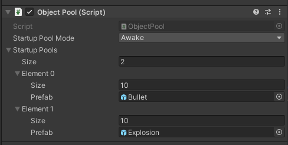

ObjectPool
==========



# Features

- Selectively pool objects based on prefab type 
- Simple and expressive syntax for instantiation and recycling
- Extension methods make it more natural and expressive
- Prefabs Pre-instantiate support

# How to Use

## Create the Prefab and Pool

This script stores objects based on what prefab they were instantiated with, so first you have to create a prefab and reference it from the scene object that is going to create it. Here I have a **Turret** that is going to instantiate a **Bullet** prefab.

```csharp
using UnityEngine;
using System.Collections;
public class Turret : MonoBehaviour
{
 public Bullet bulletPrefab;
}
```

Once that is ready, all you have to do is create the object pool for the **Bullet**.

```csharp
using UnityEngine;
using System.Collections;
public class Turret : MonoBehaviour
{
 public Bullet bulletPrefab;
 void Start()
 {
 ObjectPool.CreatePool(bulletPrefab);
 }
}
```

You only need to do this once per prefab, so usually this makes sense to do in **Start()** or **Awake()**. subsequent calls will be safely ignored.

## Spawn/Recycle

To use pooled objects, you simply have to replace your normal **Instantiate()** and **Destroy()** calls with calls to **ObjectPool.Spawn()** and **ObjectPool.Recycle()** instead!

To instantiate an object, call ObjectPool.Spawn() and pass in the prefab (and optionally position/rotation). This function returns a reference to the created instance.

```csharp
//Spawn an object from the pool
bulletInstance = ObjectPool.Spawn(bulletPrefab);
bulletInstance = ObjectPool.Spawn(bulletPrefab, position);
bulletInstance = ObjectPool.Spawn(bulletPrefab, position, rotation);
```

When you want to “destroy” the object, just call ObjectPool.Recycle() and pass in the reference that was returned by **Spawn()**.

```csharp
//Disable the object and return it to the pool
ObjectPool.Recycle(bulletInstance);
```

## Shorthand Syntax

The script comes with a few [extension methods](https://web.archive.org/web/20140718101942/http://msdn.microsoft.com/en-us/library/vstudio/bb383977.aspx "MSDN - Extension Methods") to make using the object pools even more natural and expressive!

```csharp
//Just call Spawn() on the prefab directly!
bulletInstance = bulletPrefab.Spawn(position, rotation);
//And to recycle the instance...
bulletInstance.Recycle();
```

That looks super clean, and requires no casting on you

The best way to use ObjectPool is to just completely replace Instantiate/Destroy with Spawn/Recycle. If CreatePool() was not called, Spawn/Recycle will just instantiate and destroy objects as usual, making it really easy to toggle pooling on/off per prefab.

##Reference

[Unity Patterns | New Tool: ObjectPool](https://web.archive.org/web/20150516022029/http://unitypatterns.com/new-tool-objectpool/) - ducument from here

[GitHub - Bian-Sh/ObjectPool](https://github.com/Bian-Sh/ObjectPool) - github repository
