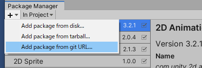
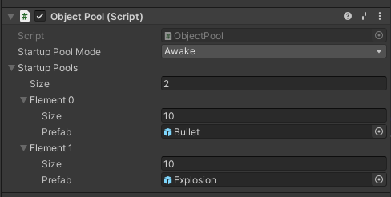

ObjectPool   
==========

<a id="chinese">[English](#english)</a>

# 功能

- 根据预制体类型有选择性地对对象进行池化
- 实例化和回收的简单明了的语法
- 扩展方法使其更加自然和表达力强
- 预制体预实例化支持
- 对 3D 对象和 UI 对象实例化友好

# 如何使用

## 创建预制体和对象池 （常规方式）

此脚本根据实例化时使用的预制体来存储对象，因此首先您需要创建一个预制体，并从将要创建它的场景对象引用它。这里我有一个名为 **炮塔（Turret）** 的对象，它将实例化一个 **子弹（Bullet）** 预制体。

```csharp
using UnityEngine;
using System.Collections;
public class Turret : MonoBehaviour
{
 public Bullet bulletPrefab;
}
```

一旦准备好，您只需要为 **子弹** 创建对象池。

```csharp
using UnityEngine;
using System.Collections;
public class Turret : MonoBehaviour
{
 public Bullet bulletPrefab;
 void Start()
 {
 ObjectPool.CreatePool(bulletPrefab);
 }
}
```

每个预制体只需要执行一次此操作，所以通常最好在 **Start()** 或 **Awake()** 中执行。后续的调用将安全地被忽略。

## 实例化/回收

要使用对象池中的对象，您只需将正常的 **Instantiate()** 和 **Destroy()** 调用替换为 **ObjectPool.Spawn()** 和 **ObjectPool.Recycle()** 调用！

要实例化一个对象，调用 **ObjectPool.Spawn()** 并传入预制体（以及可选的位置/旋转）。此函数返回对创建实例的引用。

```csharp
// 从池中生成一个对象
bulletInstance = ObjectPool.Spawn(bulletPrefab);
bulletInstance = ObjectPool.Spawn(bulletPrefab, position);
bulletInstance = ObjectPool.Spawn(bulletPrefab, position, rotation);
```

当您想要“销毁”对象时，只需调用 **ObjectPool.Recycle()** 并传入由 **Spawn()** 返回的引用。

```csharp
// 禁用对象并将其返回到池中
ObjectPool.Recycle(bulletInstance);
```

## 简写语法 （推荐方式）

该脚本附带了一些 [扩展方法](https://learn.microsoft.com/en-us/dotnet/csharp/programming-guide/classes-and-structs/extension-methods "MSDN - 扩展方法")，使用对象池变得像调用 GameObject 原生 API 那样自然！

```csharp
// 直接在预制体上调用 Spawn()！
bulletInstance = bulletPrefab.Spawn(position, rotation);
// 要回收实例...
bulletInstance.Recycle();
```

这看起来非常清晰，而且不像通常的 Unity 实例化调用那样需要您进行任何类型转换。

使用 ObjectPool 的最佳方式是完全用 Spawn/Recycle 替换 Instantiate/Destroy。如果未调用 CreatePool()，Spawn/Recycle 将像通常一样实例化和销毁对象，这样就很容易根据需要切换每个预制体的池化开关。

# 安装

### 通过 git URL 安装

您可以将 `https://github.com/Bian-Sh/ObjectPool.git?path=Packages/ObjectPool` 添加到 Package Manager 中。



> 1. 需要支持 git 包路径查询参数的 Unity 版本（Unity >= 2019.3.4f1，Unity >= 2020.1a21）。
> 
> 2. 中国用户的失败几率很高。
> 

# 参考

[Unity Patterns | 新工具：对象池（ObjectPool）](https://web.archive.org/web/20150516022029/http://unitypatterns.com/new-tool-objectpool/)


<a id="english">[简体中文](#chinese)</a>

ObjectPool   
==========



# Features

- Selectively pool objects based on prefab type 
- Simple and expressive syntax for instantiation and recycling
- Extension methods make it more natural and expressive
- Prefabs Pre-instantiate support
- Support for 3D objects as well as UI objects.

# How to Use

## Create the Prefab and Pool （Regular way）

This script stores objects based on what prefab they were instantiated with, so first you have to create a prefab and reference it from the scene object that is going to create it. Here I have a **Turret** that is going to instantiate a **Bullet** prefab.

```csharp
using UnityEngine;
using System.Collections;
public class Turret : MonoBehaviour
{
 public Bullet bulletPrefab;
}
```

Once that is ready, all you have to do is create the object pool for the **Bullet**.

```csharp
using UnityEngine;
using System.Collections;
public class Turret : MonoBehaviour
{
 public Bullet bulletPrefab;
 void Start()
 {
 ObjectPool.CreatePool(bulletPrefab);
 }
}
```

You only need to do this once per prefab, so usually this makes sense to do in **Start()** or **Awake()**. subsequent calls will be safely ignored.

## Spawn/Recycle

To use pooled objects, you simply have to replace your normal **Instantiate()** and **Destroy()** calls with calls to **ObjectPool.Spawn()** and **ObjectPool.Recycle()** instead!

To instantiate an object, call ObjectPool.Spawn() and pass in the prefab (and optionally position/rotation). This function returns a reference to the created instance.

```csharp
//Spawn an object from the pool
bulletInstance = ObjectPool.Spawn(bulletPrefab);
bulletInstance = ObjectPool.Spawn(bulletPrefab, position);
bulletInstance = ObjectPool.Spawn(bulletPrefab, position, rotation);
```

When you want to “destroy” the object, just call ObjectPool.Recycle() and pass in the reference that was returned by **Spawn()**.

```csharp
//Disable the object and return it to the pool
ObjectPool.Recycle(bulletInstance);
```

## Shorthand Syntax (Recommended way)

The script comes with a few [extension methods](https://learn.microsoft.com/en-us/dotnet/csharp/programming-guide/classes-and-structs/extension-methods "MSDN - Extension Methods") to make using the object pools even more natural and expressive!

```csharp
//Just call Spawn() on the prefab directly!
bulletInstance = bulletPrefab.Spawn(position, rotation);
//And to recycle the instance...
bulletInstance.Recycle();
```

That looks super clean, and requires no casting on your part like the usual Unity instantiation calls.

The best way to use ObjectPool is to just completely replace Instantiate/Destroy with Spawn/Recycle. If CreatePool() was not called, Spawn/Recycle will just instantiate and destroy objects as usual, making it really easy to toggle pooling on/off per prefab.

# Installation

### Install via git URL

You can add `https://github.com/Bian-Sh/ObjectPool.git?path=Packages/ObjectPool` to Package Manager

If you want to set a target version, uses the tag so you can specify a version like #2.1.0. For example
`https://github.com/Bian-Sh/ObjectPool.git?path=Packages/ObjectPool#1.0.0`


> 1. Requires a version of unity that supports path query parameter for git packages (Unity >= 2019.3.4f1, Unity >= 2020.1a21).
> 
> 2. There is a high chance of failure for users in China.
> 
> 3. Package development needs to be done in the Package folder，perhaps for avoid GUID conflicts。

# Reference

[Unity Patterns | New Tool: ObjectPool](https://web.archive.org/web/20150516022029/http://unitypatterns.com/new-tool-objectpool/)


